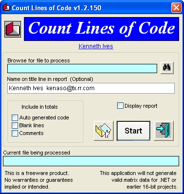



## Count Lines of code  15\-Jun\-2012

### Description

Count lines of code in your VB or C projects and files. Cannot be used for .NET or 16-bit VB projects.

=== 15-Jun-2012 Updated documentation and support modules.
 
### More Info
 

             |
---                |---
**Submitted On**   |2012-06-14 18:39:12
**By**             |[Kenaso](https://github.com/Planet-Source-Code/PSCIndex/blob/master/ByAuthor/kenaso.md)
**Level**          |Beginner
**User Rating**    |4.8 (19 globes from 4 users)
**Compatibility**  |VB 6\.0
**Category**       |[Complete Applications](https://github.com/Planet-Source-Code/PSCIndex/blob/master/ByCategory/complete-applications__1-27.md)
**World**          |[Visual Basic](https://github.com/Planet-Source-Code/PSCIndex/blob/master/ByWorld/visual-basic.md)
**Archive File**   |[Count\_Line2224946152012\.zip](https://github.com/Planet-Source-Code/kenaso-count-lines-of-code-15-jun-2012__1-73538/archive/master.zip)

